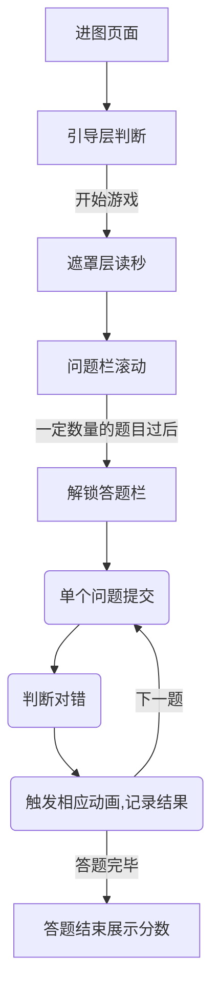

## 程序流程

```mermaid
graph TB

进图页面 --> 引导层判断 -- 开始游戏 --> 遮罩层读秒  --> 问题栏滚动 -- 一定数量的题目过后 --> 解锁答题栏 --> A(单个问题提交) --> B(判断对错) --> C(触发相应动画,记录结果) -- 答题完毕 --> 答题结束展示分数

C -- 下一题 --> A
```

## 页面参数

进入页面需要判断URL上携带的参数，